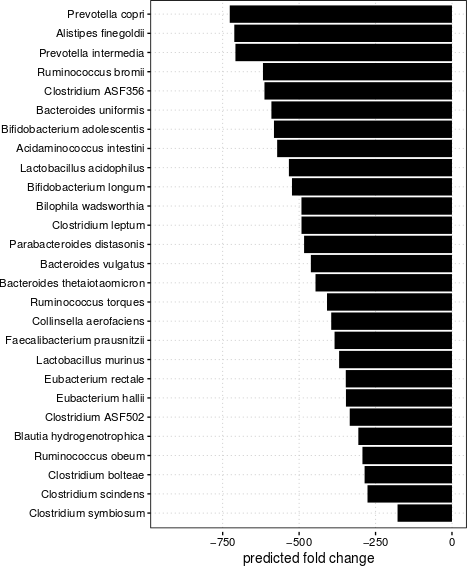

# oligomm infection response

- project report: https://www.overleaf.com/10085180pjxxvvwjxppx

# Table of Contents  
[Analysis 1 (per Category, 3 groups, old analysis)](#analysis-1)  
[Analysis 2 (per Subcategory, 3 groups, old analysis)](#analysis-2)  
[Analysis 3 (Random Forest Regression)](#analysis-3)  
[Analysis 4 (per Subsystem, 2 groups, depleted + intermediate vs. enriched)](#analysis-4)  
[Analysis 5 (per Subsystem, 2 groups, enriched + intermediate vs. depleted)](#analysis-5)  
[Analysis 6 (per Subsystem, 3 groups, enriched + intermediate vs. depleted)](#analysis-6)  
[Analysis 7 (per Subcategory, 2 groups, enriched vs. depleted + intermediate)](#analysis-7)  
[Analysis 8 (per Subcategory, 2 groups, depleted vs. intermediate + enriched)](#analysis-8)  

# Results
# Analysis 1
**Aim:** Fisher test and heat map for every SEED Category

**Results:**
- [heatmaps](results/analysis1/)
- [FDR corrected P value matrix](results/analysis1/pval_category.txt)

**Reproduce:**

```
source('analysis1.R')
```

# Results
# Analysis 1
**Aim:** Fisher test and heat map for every SEED Category

**Results:**
- [heatmaps](analysis1/)
- [FDR corrected P value matrix](analysis1/pval_category.txt)

**Reproduce:**

```
source('analysis1.R')
```

# Analysis 2
**Aim:** Fisher test and heat map for every SEED Subsystem

**Results:**
- [heatmaps](analysis2/)
- [FDR corrected P value matrix](analysis2/pval_subsystem.txt)

**Reproduce:**

```
source('analysis2.R')
```

# Analysis 3
**Aim:** Random forest regression based on Subsystem annotation with FC as response variable

**Results:**
- random forest model
```
 randomForest(x = df, y = y, ntree = 1000, importance = TRUE) 
               Type of random forest: regression
                     Number of trees: 1000
No. of variables tried at each split: 37

          Mean of squared residuals: 220040.2
                    % Var explained: 15.77
```

Model predictions for selected genomes based on SEED subsystem annotation



**Reproduce:**

```
source('analysis3.R')
```

# Analysis 4
**Aim:** Fisher test and heat map for every SEED Category. (Depleted + Intermediate) vs. Enriched

**Results:**
- heatmaps: see `analysis4` [folder](analysis4/)
- [FDR corrected P value matrix](analysis4/table1.xlsx)

**Reproduce:**

```
source('analysis4.R')
```

# Analysis 5
**Aim:** Fisher test and heat map for every SEED Category. Depleted vs. (Enriched + Intermediate)

**Results:**
- heatmaps: see `analysis5` [folder](analysis5/)
- [FDR corrected P value matrix](analysis5/table2.xlsx)

**Reproduce:**

```
source('analysis5.R')
```


# Analysis 6
**Aim:** Fisher test and heat map for every SEED Subsystem. 3 groups

**Results:**
- heatmaps: see `analysis6` [folder](analysis6/)
- [FDR corrected P value matrix](analysis6/table5.xlsx)

**Reproduce:**

```
source('analysis6.R')
```


# Analysis 7
**Aim:** Fisher test and heat map for every SEED Subcategory. enriched vs. depleted + intermediate

**Results:**
- heatmaps: see `analysis7` [folder](analysis7/)
- [FDR corrected P value matrix](analysis7/table3.xlsx)

**Reproduce:**

```
source('analysis7.R')
```


# Analysis 8
**Aim:** Fisher test and heat map for every SEED Subcategory. 2 groups, depleted vs. intermediate + enriched

**Results:**
- heatmaps: see `analysis4` [folder](analysis8/)
- [FDR corrected P value matrix](analysis8/table4.xlsx)

**Reproduce:**

```
source('analysis8.R')
```
